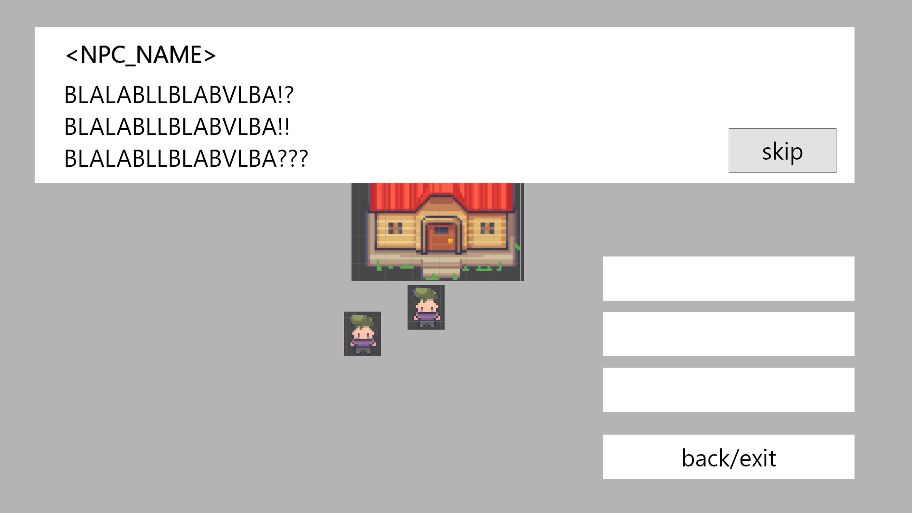

# NPC dialog
## commons
- all NPC must derive from NPC Class to inherit the NPCs_STATUS variable
    - all NPC go to idle if status go to IDLE
    - Enum for STATUS
    - e.g. guard will be divided into two classes
        - patroling guard active != idle
        - static guard active = idle

## Triggers
- on click on NPC direct, followed up with player moving towards the NPC
    - comes to NPC
        - avoids obstacles on his way
    - then opens the dialog window
- on button click in radius of NPC

## dialog design

- Takes the middle part of screen with margins from edges
- one NPC -> one quest
- box must show:
    - text on top
        - NPC name in top-left corner of text block
        - with a skip button to go to the end of the dialog
        - appear with time and sound
            - can be shown full on click
            - if all text rendered goes to next text stage on click
    - interaction possibilities on right side
        - choice buttons max 3
            - group expandeble choices to deep in groups
            - 1 or 2 max deeps in choice
        - below a back/exit button separated by margin
    - click outside the box will continue the dialog or ignore otherwise

